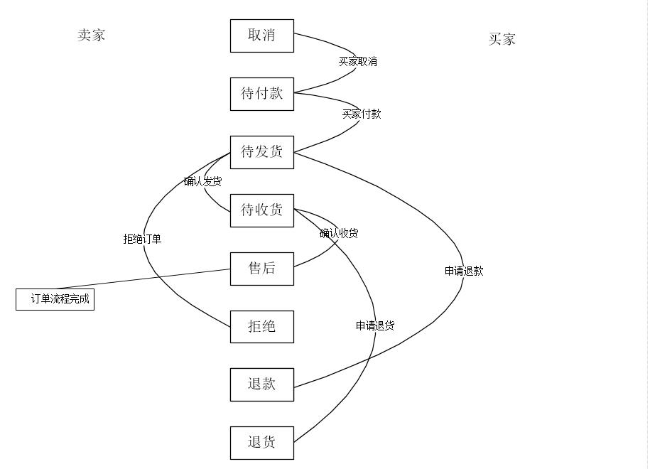

# 数据库中的复杂状态

> 所有的状态以此文档为准

### 快递跑腿订单状态

* 状态码在用户端和骑手端不一样

| 状态码 | 状态（用户） | 状态（骑手） |
| :--- | :--- | :--- |
| 0 | 取消 |  取消|
| 1 | 待支付 |  待支付|
| 2 | 待接单 | 待抢单 |
| 3 | 待送货 | 待取货 |
| 4 | 待送货 | 待送达 |
| 5 | 待评价 | 完成   |
| 6 | 完成  |    完成    |

### 订单状态

> 订单的受理 拒绝 有没有？

| 状态码 | 状态|  说明|
| :--- | :---| :---|
| 7  | 取消    | |
| 0  | 待付款  | 订单初始状态为待付款，用户在没有付款状态可以取消，用户付款后钱平台保管|
| 1  | 待发货  | 用户付款后状态变为待发货 |
| 2  | 待收货  | 用户确认收货,确认收货后平台将钱保存到用户余额（评论单独字段） |
| 3  | 售后    | 关闭删除 单独字段 |
| 4  | 退款    | 进入后台退款流程统一管理|
| 5  | 退货    |进入后台退货流程统一管理|
| 6  | 拒绝    | 商家在拒绝订单后统一退款流程|

### 订单退款状态

|状态码 | 状态|
|---| --- |
| 0 |待处理 |
| 1 |已处理|
| 2 |已拒绝|

### 订单退货状态

|状态码 | 状态|
|---| --- |
| 0 |待处理 |
| 1 |退货中|
| 2 |已完成|
| 3 |已拒绝|

### 订单支付方式

|状态码 | 状态|
|---| --- |
| 0 |余额 |
| 1 |货到付款|
| 2 |支付宝|
| 3 |微信|
| 4 |银行卡|

### 订单类型

|状态码 | 状态|
|---| --- |
| 0 |普通 |
| 1 |秒杀 |

### 配送类型

|状态码 | 状态|
|---| --- |
| 0 |快递 |
| 1 |同城配送 |
| 2 |到店自提 |